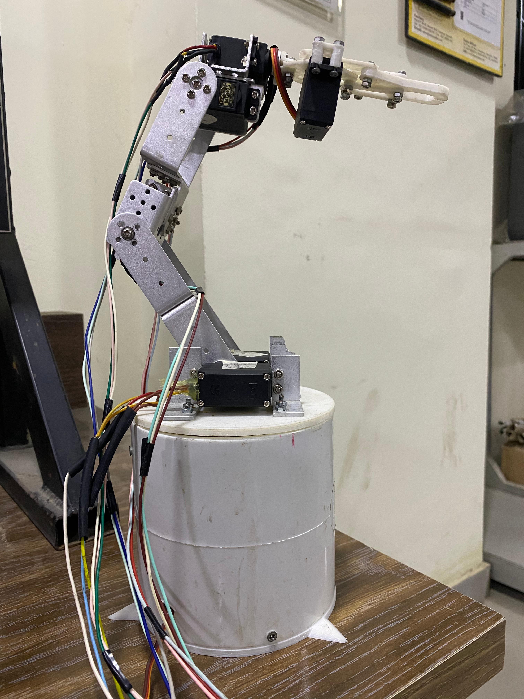
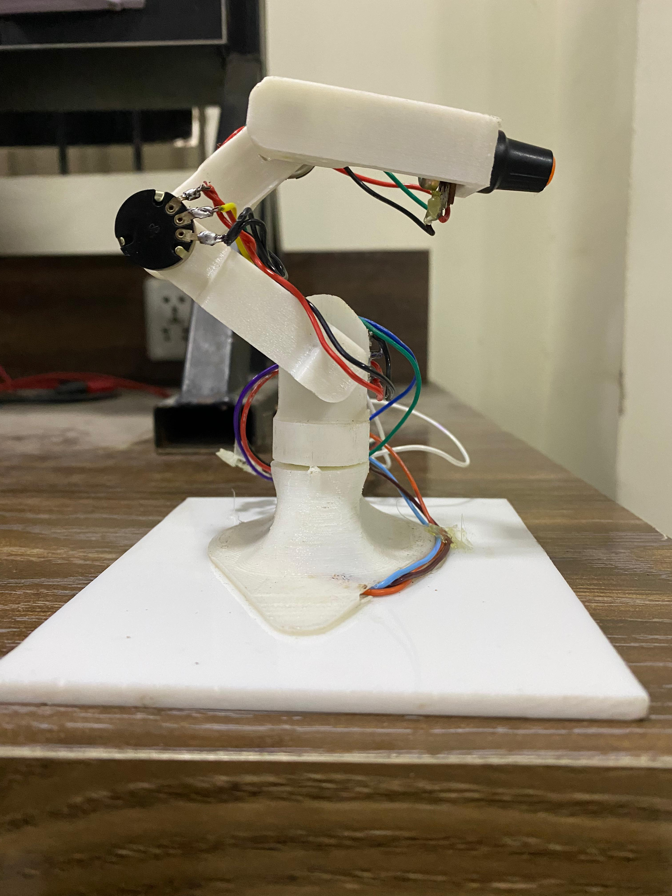

# Robotic Arm (6 DOF)

A robotic arm controlled through a smaller, hand-built master arm. Potentiometers on the master arm sense joint position, and a microcontroller maps those readings to servo positions on the main arm, so moving a joint on the small arm moves the corresponding joint on the large arm in real time.



## Team

- [Muhammad Aqib Shabbir](https://github.com/maqibshabbir)
- Muhammad Umer
- Areesh e Mustafa

## Overview

The system consists of two physical arms and one control board.

**Main arm** — the arm being controlled. The base was built around a custom PCB, with the base structure (bottom, middle, top) and body designed and modeled by the team in SolidWorks. The gripper mechanism uses an existing open-source design, adapted and 3D printed in PLA. The arm is driven by seven servo motors.

**Master arm (mini hand)** — the input device, also designed and built by the team. It uses five potentiometers to represent five of the main arm's joints, plus one push button to control the gripper (open/close).

**Control board** — an Arduino Uno reads the potentiometer and button states, maps them to servo angles, and drives the main arm's servos accordingly. A custom PCB was designed and etched at home to host the electronics, and the system is powered from a computer power supply rather than batteries.

## How it works

```
Potentiometer / Button (master arm) → Arduino Uno → Servo Motors (main arm)
```

1. Each potentiometer on the master arm outputs an analog voltage corresponding to its joint's position.
2. The Arduino reads these values and maps them from the 0–1023 ADC range to a 0–180 degree servo range.
3. The mapped angle is written to the matching servo on the main arm.
4. The push button toggles the gripper servo between open and closed positions.
5. Joint values are also printed to the Serial Monitor for live monitoring.

### Smoothing servo jitter

During testing, the servos exhibited jerky, unstable movement. An oscilloscope was used to inspect the PWM control signal directly, which helped identify the source of the instability and guided the changes made to smooth out motion. This hardware-level verification is what separated debugging this build from a purely code-side fix.

## Repository structure

```
cad/
  main_arm/
    arm-base/              Base structure — bottom, middle, top, and main parts
    arm-body/               Arm body and servo/horn components
    arm-full-assembly/      Full main arm assembly
    arm-gripper/            Gripper design (third-party, see Credits) and assembly
  mini_hand/
    arm-full-assembly/      Full master arm assembly
    arm-full-body/          Master arm links and base

docs/
  robotic_arm_6dof_technical_report.pdf   Full project report

firmware/
  arm_controller.ino        Arduino firmware

media/
  main_arm.jpeg              Photo of the completed main arm
  mini_hand.jpeg              Photo of the completed master arm

models/
  main_arm.stl               Interactive 3D model of the main arm
  mini_arm.stl                Interactive 3D model of the master arm

pcb/
  arm_pcb_print.pdf          PCB layout used for home etching
  pcb_front.jpg               Photo of the built PCB, front
  pcb_back.jpg                Photo of the built PCB, back
```

## Photos

 

*Left: the main 6 DOF robotic arm. Right: the master arm used to control it.*

## 3D Models

Both arms can be viewed and rotated directly in the browser using GitHub's built-in 3D viewer — no software download required. Click a link below, then click-drag to rotate and scroll to zoom.

- [Main Arm — main_arm.stl](models/main_arm.stl)
- [Mini Hand — mini_arm.stl](models/mini_arm.stl)

## Hardware

- Microcontroller: Arduino Uno
- 7x servo motor (main arm joints and gripper)
- 5x potentiometer (master arm joint sensing)
- 1x push button (gripper control)
- Custom PCB (etched at home from the layout in `pcb/arm_pcb_print.pdf`)
- Power: computer power supply unit
- 3D printed gripper (PLA)
- Base: custom PCB-integrated structure, with bottom/middle/top sections modeled in SolidWorks

## Software tools used

- SolidWorks — CAD modeling of the base, body, and master arm
- Arduino IDE — firmware
- Proteus — schematic and PCB design assistance
- Oscilloscope — signal-level debugging of servo control lines

## Getting started

1. Open `firmware/arm_controller.ino` in the Arduino IDE.
2. Wire the potentiometers and servos according to the pin definitions at the top of the code.
3. Upload the firmware to the Arduino Uno.
4. Power the board using a regulated supply matching the servo current requirements.
5. Open the Serial Monitor (9600 baud) to view live joint values while testing.

## Results

The arm reliably mirrored the master arm's movements, with the gripper responding correctly to the push button. Oscilloscope-guided debugging resolved early jitter issues, producing smooth, consistent motion. Full details, results, and discussion are documented in the project report: [`docs/robotic_arm_6dof_technical_report.pdf`](docs/robotic_arm_6dof_technical_report.pdf)

## Credits

- Gripper CAD design: third-party design, adapted for this build (source to be added)
- PCB layout assistance: Engr. Zaryab Qazi

## License

This project is released under the MIT License. See [`LICENSE`](LICENSE) for details.
